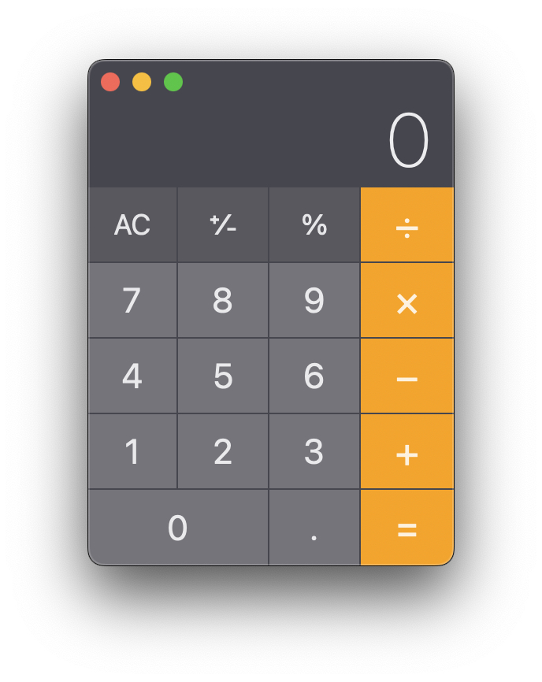
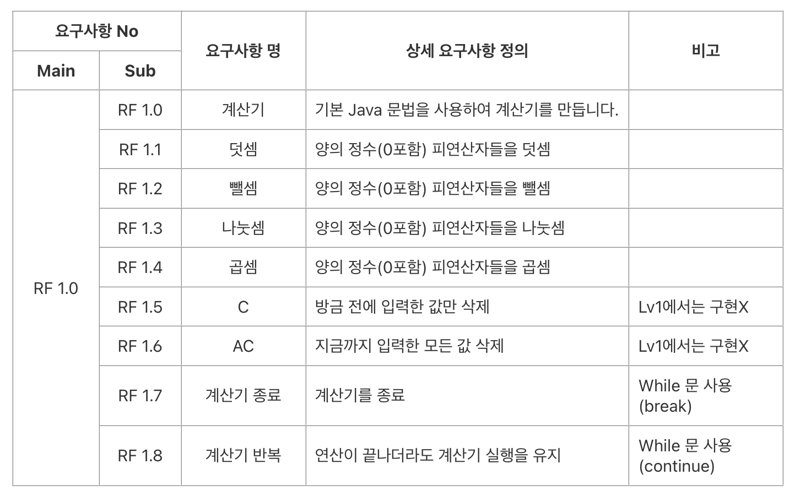
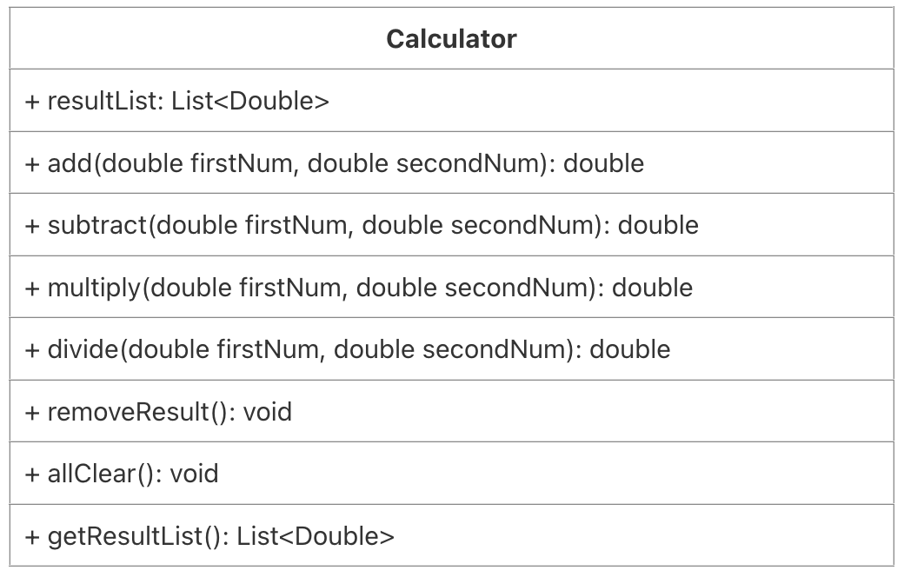

# 계산기 프로젝트

## 프로젝트 소개

쌀집 계산기를 모티브로 하여 최대한 비슷하게 기능을 구현하고자 했습니다. 
이번 프로젝트의 핵심 목표는 자바 문법의 실습과 객체 지향 개념의 적용입니다.
 - Lv1 : 클래스를 사용하지 않고 간단한 자바 문법을 사용하여 계산기를 구현
 - Lv2 : 클래스를 사용하여 계산기를 구현

## 요구사항 정의서

## 애플리케이션 아키텍처

## LV1. 클래스 없이 기본적인 연산을 수행할 수 있는 계산기 만들기
### 1. 양의 정수(0 포함)를 입력받기
 - Scanner를 사용하여 양의 정수 2개(0 포함)를 전달 받을 수 있습니다.
 - 양의 정수는 각각 하나씩 전달 받습니다.
 - 양의 정수는 적합한 타입으로 선언한 변수에 저장합니다.

### 2. 사칙연산 기호를 입력받기(+, -, *, %)
 - Scanner를 사용하여 사칙연산 기호를 전달 받을 수 있습니다.
 - 사칙연산 기호를 적합한 타입으로 선언한 변수에 저장 합니다.(charAt(0))

### 3. 양의 정수 2개와 사칙연산 기호를 사용하여 연산을 진행한 후 결과값을 출력하기
 - 키워드: if, switch
 - 사칙연산 기호에 맞는 연산자를 사용하여 연산을 진행합니다.
 - 입력받은 연산 기호를 구분하기 위해 제어문을 사용합니다.(if, switch 등)
 - 연산 오류가 발생할 경우 해당 오류에 대한 내용을 정제하여 출력합니다. 
   ex) “나눗셈 연산에서 분모(두번째 정수)에 0이 입력될 수 없습니다."

### 4. 반복문을 사용하되, 반복의 종료를 알려주는 "exit" 문자열을 입력하기 전까지 무한으로 계산을 진행할 수 있도록 소스코드 수정하기
 - 키워드: 무한으로 반복, 수정하기(처음부터 무한 반복 X, 위 스텝별로 진행하며 수정)
 - 반복문을 사용(for, while 등)

## LV2. 클래스를 적용해 기본적인 연산을 수행할 수 있는 계산기 만들기
### 1. 사칙연산을 수행 후, 결과값 반환 메서드 구현 & 연산 결과를 저장하는 컬렉션 타입 필드를 가진 Calculator 클래스를 생성
 - 사칙연산을 수행 후, 결과 값을 반환하는 메서드 구현
 - 연산 결과를 저장하는 컬렉션 타입 필드를 가진 Calculator 클래스를 생성

### 2. Lv1에서 구현한 App 클래스의 main 메서드에 Calculator 클래스가 활용될 수 있도록 수정
 - 연산 수행 역할은 Calculator 클래스가 담당
 - 연산 결과는 Calculator 클래스의 연산 결과를 저장하는 필드에 저장
 - 소스 코드 수정 후에는 수정 전의 기능들이 반드시 똑같이 동작해야 함

### 3. App 클래스의 main 메서드에서 Calculator 클래스의 연산 결과를 저장하고 있는 컬렉션 필드에 직접 접근하지 못하도록 수정(캡슐화)
 - 간접 접근을 통해 필드에 접근하여 가져올 수 있도록 구현합니다. (Getter 메서드)
 - 간접 접근을 통해 필드에 접근하여 수정할 수 있도록 구현합니다. (Setter 메서드)
 - 위 요구사항을 모두 구현 했다면 App 클래스의 main 메서드에서 위에서 구현한 메서드를 활용

### 4. Calculator 클래스에 저장된 연산 결과들 중 가장 먼저 저장된 데이터를 삭제하는 기능을 가진 메서드를 구현한 후 App 클래스의 main 메서드에 삭제 메서드가 활용될 수 있도록 수정
 - 키워드: 컬렉션
